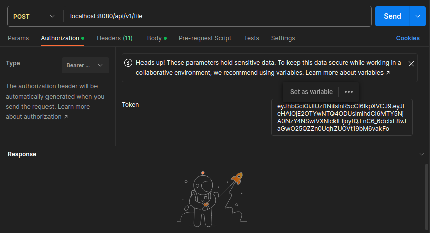
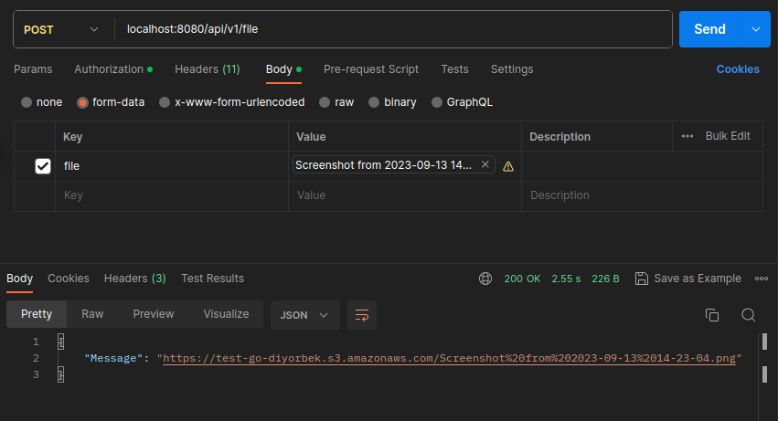

<h1>S3 service for uploading files to AWS S3 with authentication system</h1>
1. First rename <i>.env.example`</i> file to <i>.env</i> and enter your data to it corresponding order.
 
2. Run <code>docker compose up</code>
 
<h3>Endpoints:</h3>
<h4>1. <code>localhost:8080/auth/sign-up</code> send request it with your json data like this</h4>
 
<code>{ "username": "example_user1", "password":"examplePasword1@"}</code> 
After successfully auth returns <code>id</code> of the user.
 
<image src="images/sign-up.png"></image>
 
<h4>2. <code>localhost:8080/auth/sign-in</code> send your json data:</h4> 
<code>{ "username": "example_user1", "password":"examplePasword1@"}</code>. After successfully
sign-in it returs <cod>jwt</cod> token like this:  
<image src="images/sign-in.png"></image> 
<h4>3. <code>localhost:8080/api/v1/file</code> send your image file with <code>file</code> key in header. System accepts only image files.
To send your image you need to enter jwt token. After that You can send image. Image size must be no more than 8MBs.
After successfully sent file system return link of this file in the cloud:</h4>

.